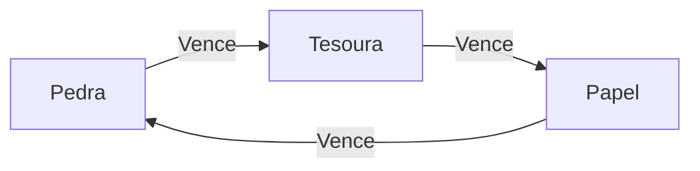
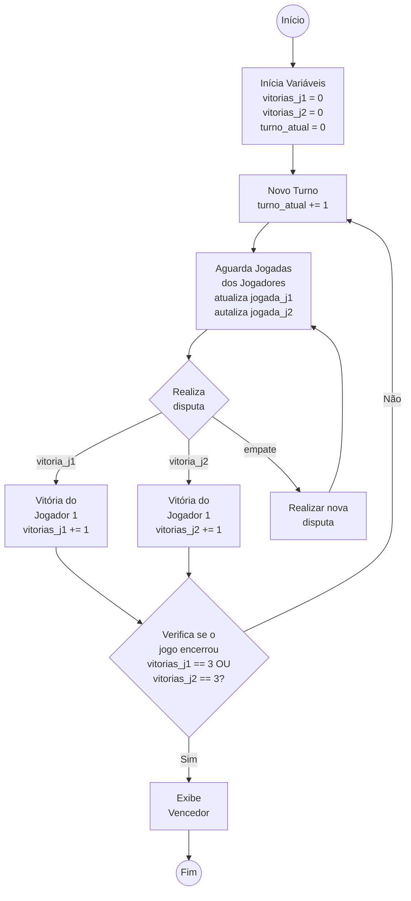

# Jokenpô

*IMPORTANTE: Este repositório é parte integrante da disciplina de Porgramação de Jogos em Rede do Curso Integrado em Programação de Jogos Digitais do IFRN - Campus Ceará-Mirim.*

## 1 Descrição do Projeto de Jogo

A descrição do projeto de jogo deverá reunir o conjunto de informações necessárias para comprender os dados gerados pelo jogo, as regras e os fluxos da jogada.

### 1.1 Regras do Jogo

- O jogo será disputado em uma melhor de 05 (cinco) turnos;
- O primeiro jogador a conseguir 3 vitórias ganha;
- Um turno não pode acabar em empate (caso haja empate, os jogadores jogam novamente até que haja um vencedor);

### 1.2 Regras do Turno

- Em cada turno, cada jogador irá escolher sua jogada (Pedra papel ou Tesoura);
- Será verificado o resultado conforme diagrama abaixo.
  

## 2 Especificação do Jogo

### 2.1 Descrição dos dados do jogo

A descrição dos dados do jogo permite identificar o conjunto e o tipo das variáveis que precisaremos criar para o seu funcionamento.

- `vitorias_j1`
  - Armazena a quantidade de vitórias do jogador 1;
  - Valores possíveis: [0 - 3]
- `vitorias_j2`
  - Armazena a quantidade de vitórias do jogador 2;
  - Valores possíveis: [0 - 3]
- `turno_atual`
  - Armazena qual o turno atual;
  - Valores possíveis: [0 - 5]
- `jogada_j1`
  - Armazena a jogada atual do jogador 1;
  - Valores possíveis: [Pedra, Papel, Tesoura]
- `jogada_j2`
  - Armazena a jogada atual do jogador 2;
  - Valores possíveis: [Pedra, Papel, Tesoura]
- `resultado_disputa`
  - Armazena o resultado da disputa
  - Valores possíveis: [vitoria_j1, empate, vitoria_j2]

### 2.2 Descrição do fluxo do jogo (local)

