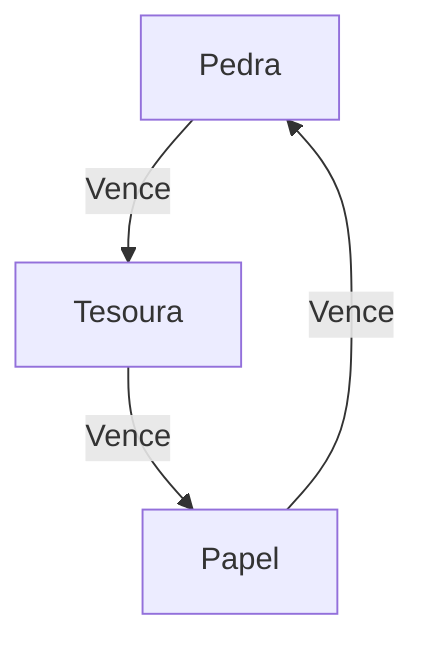

# Jokenpô

*IMPORTANTE: Este repositório é parte integrante da disciplina de Porgramação de Jogos em Rede do Curso Integrado em Programação de Jogos Digitais do IFRN - Campus Ceará-Mirim.*

## Etapa 01 - Descrição do Projeto de Jogo

A descrição do projeto de jogo deverá reunir o conjunto de informações necessárias para comprender os dados gerados pelo jogo, as regras e os fluxos da jogada.

### Regras do Jogo

* O jogo será disputado em uma melhor de 05 (cinco) turnos;
* O primeiro jogador a conseguir 3 vitórias ganha;
* Um turno não pode acabar em empate (caso haja empate, os jogadores jogam novamente até que haja um vencedor);

### Regras do Turno

* Em cada turno, cada jogador irá escolher sua jogada (Pedra papel ou Tesoura);
* Será verificado o resultado conforme diagrama abaixo.

